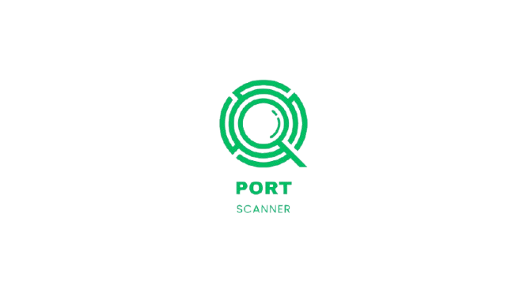

<p align="center">
  
</p>
</p>

<h1 align="center">Port Scanner </h1>

<p align="center">
  
  
  
    
  
   
  
</p>

## Table of Contents

- [About](#about)
- [Features](#features)
- [Setup](#setup)
  - [Optional - Creating a virtual environment with venv](#optional---creating-a-virtual-environment-with-venv)
- [Installation](#installation)
- [How to Install Dependencies](#how-to-install-dependencies)
- [Command-line usage](#command-line-usage)
- [Feedback and Contributions](#feedback-and-contributions)
- [Code of Conduct](#code-of-conduct)
- [Contributors](#contributors)
- [License](#license)

# About

This is a Port Scanner developed in Python, responsible for checking open, filtered, and closed ports through TCP and UDP protocols with support for IPv4 and IPv6.

The project was built as a personal study and learning tool in cybersecurity, with the intent of building a solid technical portfolio.  I used AI tools for structure and testing, but the code was entirely understood, reviewed, and adapted by me.

Among the implemented features are the use of parallelism with threads, structured logs, support for arguments via command line (CLI), and export of results in JSON files.

## Learnings

During development, I was able to deepen my knowledge in:

- Socket programming (TCP/UDP)
- Using Scapy to obtain more reliable responses over UDP.
- I opted to use threads to parallelize the scan and speed up response time.
- Exception handling and logging for error handling
- Structuring modular projects
- Automated testing and best practices

## Features
- Complete support for IPv4 and IPv6 addresses.
- TCP and UDP port scan utilizing scapy library.
- Accurate identification of open, closed, and filtered ports.
- Prior checking of network and IP.
- CLI interface using argparse.
- Scan results are automatically saved as .json files.
- Exception handling is done using a configurable log system with levels of severity and stored in log files.
- Parallelism using threads.
- Modular design with clear separation of responsibility.


## Setup:
Requirements:

- Python 3.10 or higher installed.
- Operational System with socket support (Linux, macOS, Windows).
- 'pip' tool for installing dependencies.
- Virtual environment ('venv') - optional, but recommended.
- Administrator/root permissions on Unix/Linux systems (for port scanning).

This project is executed via main.py and depends on external libraries described in the requirements.txt file. 

In order to avoid dependency conflicts, it is recommended to use a virtual environment.

### Optional - Creating a virtual environment with `venv`:

**Windows:**
```bash
python -m venv venv
.\venv\Scripts\activate
```

**Linux/macOS:**
```bash
python3 -m venv venv
source venv/bin/activate
```

**Activation:**

```bash
python -m venv venv
source venv/bin/activate
```

## 🔧 Installation
```bash
git clone https://github.com/seuusuario/portscannerx.git
cd portscannerx
pip install -r requirements.txt
```

## How to Install Dependencies

pip install -r requirements.txt

```md
> Make sure the environment is activated before running the scanner.
```

## Command-line usage

To run the project, use the command line below:

- python main.py --ip example.com --start_port 20 --end_port 80

## Feedback and Contributions

If you want to improve something, solve bugs, or give feedback, or suggestions please note that contributions are welcome, feel free to open a pull request or issue!

## Code of Conduct

To ensure a respectful environment, this project also follows the [Contributor Covenant](https://www.contributor-covenant.org/en-us/version/2/1/code_of_conduct/) as its code of conduct.

# Contributors

- Karolainy Ramos – main developer

# License

This project is licensed under the [MIT License](LICENSE) © 2025 Karolainy Ramos.
